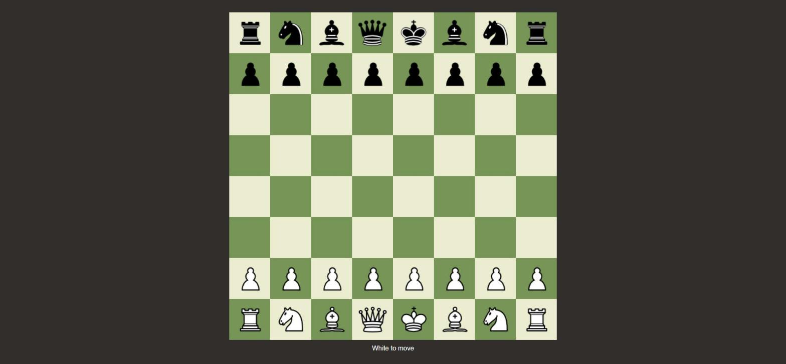

# Chess

A chess board in React + TypeScript, with the movement rules written from
scratch — no chess library. Click a piece, click a destination; illegal moves
are refused.



## What it does

- Full board with both armies in their opening positions
- Movement rules per piece: pawn, rook, knight, bishop, queen, king
- Path blocking — a rook cannot jump a piece standing between origin and target
- Captures, turn alternation, check and checkmate/stalemate detection
- Castling (kingside and queenside), en passant, pawn promotion with a piece
  picker
- Illegal moves that would leave the mover's own king in check are refused,
  including moves by pinned pieces

## What it does not do

No move history, no undo, no PGN/FEN import or export, no clock, no computer
opponent.

## Running it

```bash
npm install
npm run dev
```

## Testing

The rules engine is plain TypeScript with no React or DOM dependency, so it's
covered by unit tests: legal move generation, check detection, absolute
pins, castling (including through-check restrictions), en passant, and
promotion.

```bash
npm test
```

## About the code

A weekend project from 2022, written while learning TypeScript, later
extended with the missing rules and refactored along the way. The rules
engine lives in `src/chess/` as pure functions operating on an 8x8 board
array (`board.ts` for board setup/helpers, `moves.ts` for move generation and
check detection, `game.ts` for turn/status management) — no DOM, no React,
easy to test in isolation. `Board.tsx` is UI only: it holds the current game
state and renders it.

## Stack

React 18 · TypeScript · Vite · Vitest
